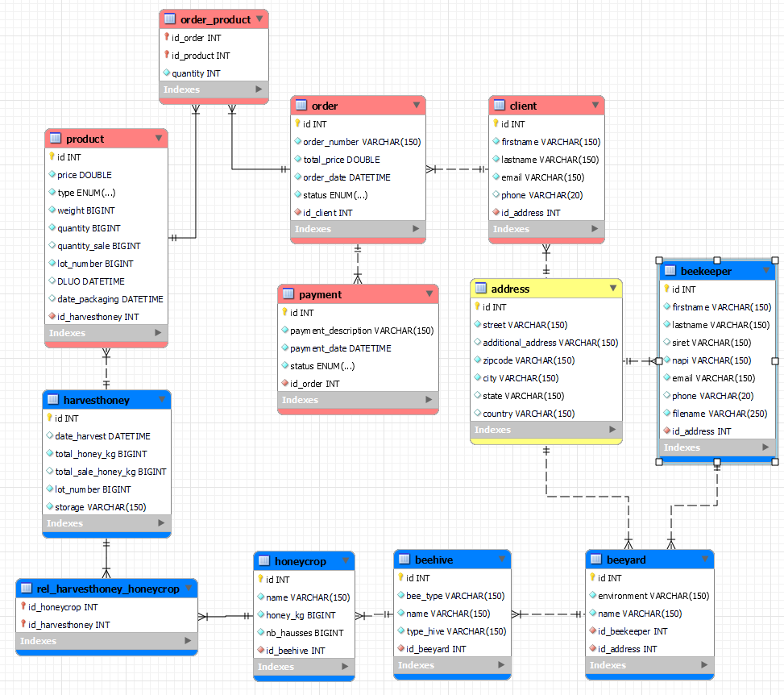

# 🐝 BEE API'C 🐝

## Description

Project to traking a jar of honey, so that a consumer can know the origin of the product

## Structure

```
api-project
|
+--src
    |
    +--database
    |
    +--store
        |
        +--client
        +--order
        +--product
    |
    +--beekeeping
        |
        +-- address
        +--beekeeper
        +--beeyard
        +--beehive
        +--honey
            |
            +--honeycrop
            +--harvesthoney
```

## Schéma de base de données


## Documentation
pour plus de détail, consulter [la documentation du projet](documentation/index.html)

## Installation
Installer la base de donnée, run script: script.sql

```
api-project
|
+-- src
    |
    --+ database
```

Modifier le fichier .env avec vos configurations :
```
DATABASE_HOST=localhost
DATABASE_PORT=3306
DATABASE_USER=root
DATABASE_PASSWORD=
DATABASE_NAME=apic-project
```
Installer les dépendances :
```bash
$ npm install
```

## Running the app

```bash
# development
$ npm run start

# watch mode
$ npm run dev

# production mode
$ npm run prod
```

## Test

```bash
# unit tests
$ npm run test

# e2e tests
$ npm run test:e2e

# test coverage
$ npm run test:cov
```

## Stay in touch

- Author - [COLAS Vincent](https://www.linkedin.com/in/colas-vincent/)
